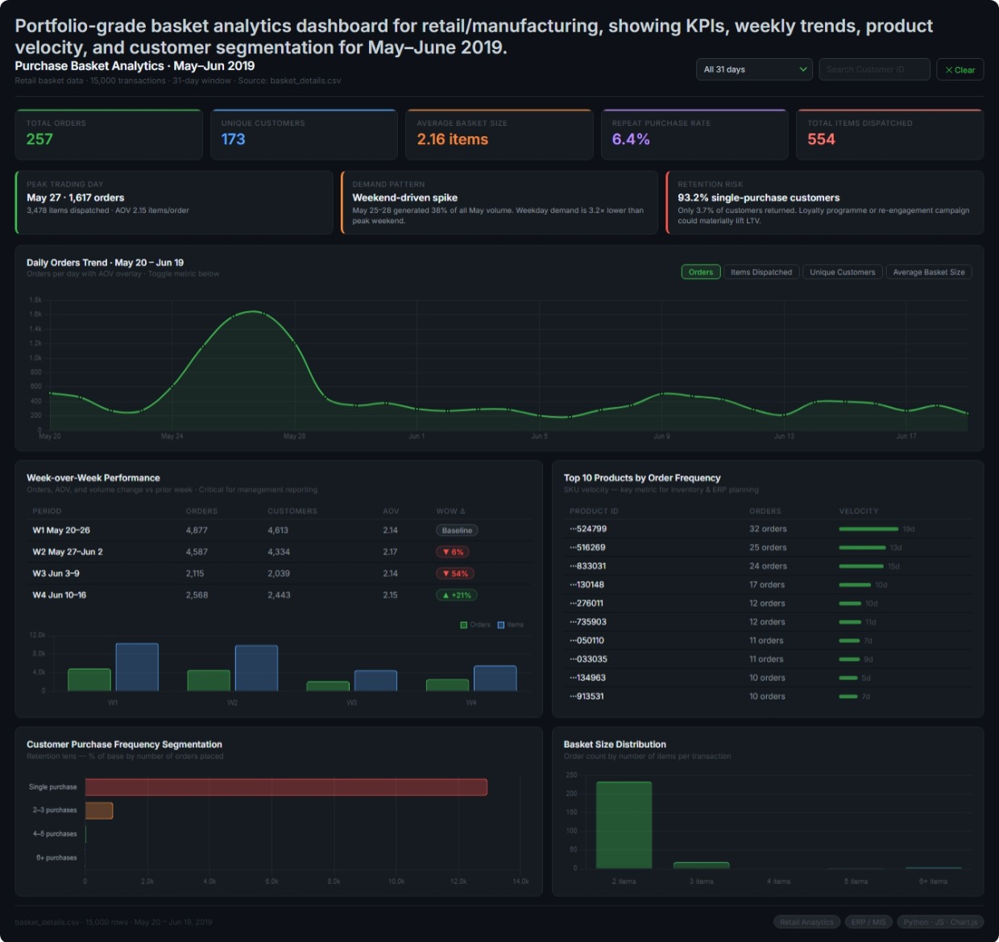

# 📊 Retail Sales Analytics Dashboard

An interactive Retail Sales Analytics Dashboard built using **HTML, CSS, JavaScript, and Chart.js** to analyze customer purchasing behavior, product performance, and operational KPIs from retail transaction data.

This project demonstrates practical dashboard development, business analytics, KPI design, and interactive reporting skills relevant to **Data Analyst**, **MIS Executive**, and **ERP Reporting** roles.

---

## 🌐 Live Demo

🔗 https://bhandari-nikita.github.io/retail-sales-analytics-dashboard/

---

## 📸 Dashboard Preview



---

## 🎯 Project Objective

Businesses generate thousands of retail transactions every day. Without proper visualization, it becomes difficult to identify sales trends, customer behavior, and operational performance.

This dashboard transforms raw transaction data into meaningful business insights through interactive visualizations and performance metrics, enabling faster and more informed decision-making.

---

## ✨ Key Features

- Interactive KPI dashboard
- Daily trend analysis
- Week-over-Week performance comparison
- Customer purchase frequency segmentation
- Basket size distribution
- Product velocity analysis
- Customer search with drill-down
- Date range filtering
- Responsive dashboard interface

---

## 📈 Business KPIs

The dashboard tracks several important business metrics, including:

- Total Orders
- Unique Customers
- Average Basket Size
- Repeat Purchase Rate
- Total Items Dispatched
- Peak Trading Day
- Product Order Frequency
- Customer Retention Insights
- Weekly Performance Comparison

---

## 💡 Business Insights

The dashboard helps answer questions such as:

- Which days generate the highest order volume?
- How many customers make repeat purchases?
- Which products are ordered most frequently?
- How does weekly performance compare over time?
- What is the average basket size?
- Which customers contribute multiple purchases?

---

## 🛠 Technology Stack

| Technology | Purpose |
|------------|---------|
| HTML5 | Dashboard Structure |
| CSS3 | Responsive UI Design |
| JavaScript (ES6) | Data Processing & Interactivity |
| Chart.js | Data Visualization |

---

## 📂 Project Structure

```
retail-sales-analytics-dashboard/
│
├── Dashboard.html
├── README.md
└── screenshots/
    └── dashboard-overview.jpeg
```

---

## 🚀 Skills Demonstrated

- Dashboard Development
- Data Visualization
- Business KPI Design
- Retail Analytics
- Customer Segmentation
- Interactive Reporting
- Business Intelligence Fundamentals
- Frontend Development

---

## 📊 Dataset

**Source:** Kaggle Retail Basket Dataset

> https://www.kaggle.com/datasets/berkayalan/ecommerce-sales-dataset

---

## 🔮 Future Enhancements

- Power BI version
- SQL database integration
- Python (Pandas) data preprocessing pipeline
- Automated reporting
- Sales forecasting
- Inventory analytics
- Export reports to PDF/Excel

---

## 👤 Author

**Nikita Bhandari**

Aspiring Data Analyst | SQL | Advanced Excel | Dashboard Development | Python | TallyPrime

- GitHub: https://github.com/bhandari-nikita
- LinkedIn: https://www.linkedin.com/in/nikita-b-8b186a336

---

## ⭐ Feedback

If you have suggestions for improving this dashboard or would like to discuss data analytics, feel free to connect with me on LinkedIn or open an issue in this repository.
